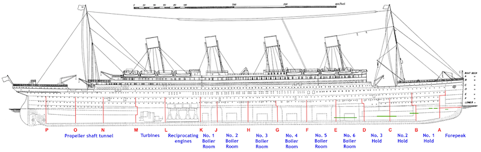

# Titanic: Background history

The wreck of the RMS Titanic was one of the worst shipwrecks in history, and is certainly the most well-known.  On April 15, 1912, during her maiden voyage, the Titanic sank after colliding with an iceberg, killing 1502 out of 2224 passengers and crew.  This sensational tragedy shocked the international community and lead to better safety regulations for ships.

One of the reasons that the shipwreck lead to such loss of life is that were not enough lifeboats for the passengers and crew.  Although there was some element of luck involved in surviving the sinking, some groups of people were more likely to survive than others, like women, children, and the upper-class.

We will apply the tools of Machine Learning and use this dataset as an intro to Amazon SageMaker

Start the exercise by navigating to [Lab1](./1-DataPreparation.ipynb)